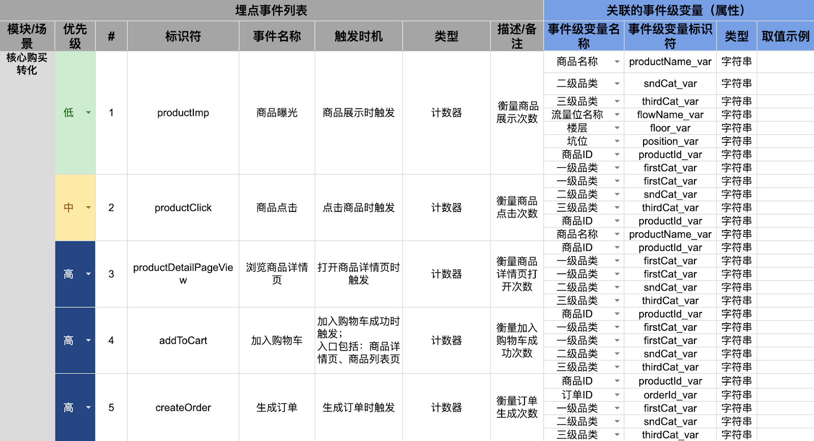

# 数据埋点（事件跟踪）

埋点， 顾名思义就是借助埋点（写代码）来采集数据，在需要监测用户行为数据的地方加上一段代码。

## 埋点方式

客户端埋点适用于用户界面行为的上报，服务端埋点适用于业务操作的上报。
以经典的「电商购买」业务流程为例：
打开详情页-》加入购物车-》提交订单-》支付成功

### 客户端埋点

「打开商品详情页」、「加入购物车」、「提交订单」这 3 个事件均为客户端的用户行为，适合客户端埋点。
因为：
客户端可采集的字段更丰富；
有利于关联用户设备标识与用户行为。

### 服务端埋点

对于「支付成功」这个业务结果事件，一般建议使用服务端埋点：
因为：
有利于排除客户端网络环境不稳定造成的数据误差。
如果客户端界面上有多个支付入口，使用服务端埋点可以确保各入口数据完整上报，而客户端埋点容易漏埋。

上述场景将客户端埋点与服务端埋点两种埋点方式相结合，互补各自的优劣势，达到数据的完整、准确、高效上报。

#### 适用业务场景

1. 发生的入口比较多
2. 业务状态在客户端没有体现

### 比较


客户端埋点需要多个客户端（Android、iOS、PC）开发团队的埋点资源，而使用服务端埋点，则可以节省多个开发团队的沟通成本。


## 埋点设计

### 确认事件与变量

事件：指产品中的操作
变量：指描述事件的属性

可以按照产品流程（用户旅程）来设计关键事件，如果想要进一步描述事件属性，那么就可以将属性作为事件的变量。

以汉光百货「站内转化路径追踪」这一电商行业的核心场景为例：
其需要追踪的关键指标，是四个产品操作步骤：浏览商品详情页、加入购物车、结算、支付成功。

这四个指标分别代表四个事件。
如果想要进一步监控不同品牌、不同商品的购买转化率，就需要用品牌和商品的维度去拆解关键指标，那么品牌和商品就是这四个事件的变量。

### 明确事件的触发时机

事件的触发时机，往往是影响数据准确性的重要因素。
以「加入购物车」事件为例，触发时机是点击这个按钮时，还是加入购物车成功时呢？

不同的触发时机代表不同的数据统计口径，我们要尽量选择最贴近业务的统计口径，然后再与开发沟通，在可行性与业务贴合度之间找到最优解。

另外，由于产品中可能有多个入口均可“加入购物车”，触发入口是否已列举完整，也会影响数据准确性。
这个时候，我们可以采用 MECE 原则，即相互独立，完全穷尽：不要重复列举，但要包含所有入口。

### 规范命名

对事件进行规范统一的命名，有助于提高数据的实用性及数据管理效率。
建议使用「动词+名词」或者「名词+动词」的规则来命名，比如“加入购物车”事件，就可以命名为：addToCart。

无论如何，需要确保的是，团队/公司内部必须建立统一的认知，使用同一套命名规则。

### 明确优先级

考虑到埋点的技术实现成本以及资源有限性，在设计埋点方案时，一定要对埋点事件有明确的优先级排布。
在汉光百货这个案例中，优先级最高的场景是“站内转化路径追踪”。
我们以这个场景为轴心，了解每个转化步骤的情况，找到优化点对症下药，再对优化点进一步的监控与验证分析，最终实现价值的持续交付。



## 埋点协作流程


事实上，如果产品经理等业务人员总是能用上准确的、及时的数据，并能深度分析，
那么这家公司的组织能力、数据治理的能力，以及数据驱动的文化往往都很优秀。

## 埋点的劣势

最终可能导致诸如：没有埋上点，埋点数据异常，埋点上线业务已经下线，想分析的维度忘了「埋」上去等等。


# 无埋点

前端自动采集全部事件并上报所有的数据，并通过「圈选」来获取需要使用的事件。
圈选本身不需要组织协作，产品经理可以不依赖任何人就能采集到数据，并马上在分析工具中使用，所见即所得。

## 劣势

1. 部分业务维度无法采集
    比如，能够知道用户点击了购买，但不知道购买了什么
2. 滑动等行为，无埋点采集暂时无法实现
3. 无埋点采集的数据是通过界面位置和上下级关系来标示自己的，一旦界面发生较大变化，会导致数据无法持续采集，需要重新圈选。
4. 数据准确性也会受客户产品开发框架、开发规范以及能力的影响。

# 使用场景

## 探索式数据场景
这类场景更适合使用无埋点事件，基本上也只能使用无埋点事件。

场景属性：
```text
业务属性弱，交互属性强；
需求及时性强，要快速落地得出结论；
数据使用周期短，不需要长期监控；
相比准确性，更需要趋势稳定；
非核心数据，数据可及性 (access data) 强。
```

如：
```text
做了一场运营活动，但没有埋点的产研资源；
想衡量交互细节，而需要查看的交互细节非常多；
想查看一个用户在访问时的一切行为轨迹，探索用户使用产品场景；
产品每周发版，想要快速衡量每次发版的效果；
要做一个分析，发现没有所需事件，打点和积累数据来不及，又需要尽快产出结论；
当新功能上线时，你突然发现有一个重要的元素忘了埋点。
```

## 监控与分析式数据场景

这类场景是核心 KPI 监控和深度业务分析，建议使用埋点事件，尤其是深度业务分析只能使用埋点事件。

场景属性：
```text
数据稳定准确，反应真实业务场景；
需要长期监控，数据需要长期存储；
业务属性丰富，可以做深度业务分析；
监控核心 KPI，指标需要少而精；
需要设置数据权限，数据可及性 (access data) 弱。
```

如：
```text
需要每天、每周、甚至每月汇报 KPI 表现；
需要分析过去一年核心 KPI 的增长情况；
需要对业务进行深度分析：比如不同 SKU 的购买转化分析；
需要进行归因分析：比如产品不同入口的带来的销售额分析。
```