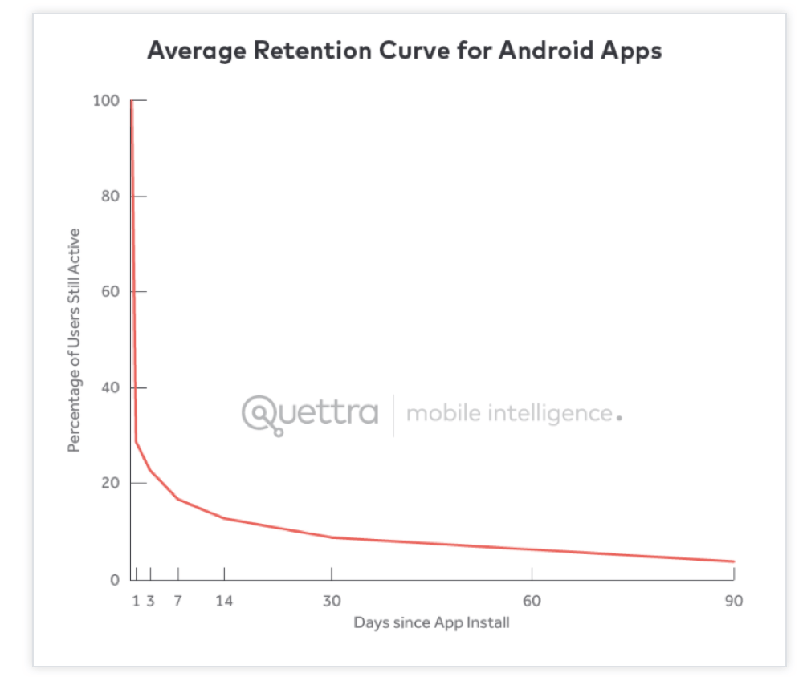

#  RARRA 模型

* ***为什么说AARRR模型已经是过去式？***

AARRR模型很受欢迎，因为它很简单，突出了增长的所有重要元素。
最主要的是：
AARRR模型是围绕着每个营销人员最喜欢的增长部分而建立的——拉新获客。
获客和营销是相当的同义词——由于大多数黑客增长人员都是营销人员，因此获客已成为创业公司最倚重的重要指标。

那为什么说海盗指标-AARRR模型已经不再是今天这个时代有效的黑客增长模型？

因为对于大多数应用而言，获取新用户几乎毫无意义。现在平均每个App在安装后的情况：
```text
前3天内将流失掉77％的DAU。
在30天内，它将流失90％的DAU。
而到了90天，流失率跃升到95％以上。
```


市场竞争激烈，用户获客成本已经不再便宜，简单地发布一个应用程序，不再是一个保证赚钱的方式。
在当前的情况下，以拉新获客为中心的增长模式是没有意义的。
它创造了Brian Balfour所说的“无意义成长之轮”。

因为AARRR专注于获客(Acquisition)，McClure是在2007年获客成本还比较低廉的时候编写的，
而现在广告/社交渠道的流量价格已经很高，获客的成本与日俱增，
市场情况和2007年已经完全不同。现在黑客增长的真正关键在于用户留存，而不是获客。

* 什么是 RARRA？

托马斯·佩蒂特Thomas Petit和贾博·帕普Gabor Papp对于海盗指标-AARRR模型的优化。

***RARRA模型突出了用户留存的重要性***
如果你在留存率低迷的情况下仍然花钱拉新用户，那么你其实就只是在租用流量而已，你根本就算不上是真正的获客。
你能让用户回到你的产品吗？


```text
用户留存 Retention：为用户提供价值，让用户回访。
用户激活 Activation：确保新用户在首次启动时看到你的产品价值。
用户推荐 Referral：让用户分享、讨论你的产品。
商业变现 Revenue：一个好的商业模式是可以赚钱的。
用户拉新 Acquisition：鼓励老用户带来新用户。
```

* RARRA通过最重要的指标来关注增长：用户留存
你能让用户回到你的产品吗？
```text
如果答案是肯定的，那么你实际上正在建立一个用户群。
如果答案是否定的，那么你基本上只是在租用流量。
```

正如Brian Balfour所说：真正反映整体真实增长情况的指标都应该被首先重视。
留存率是反映用户真正价值的指标——因为用户会真实的每天来使用你的产品。
当我们优先考虑用户留存时，我们正在构建一个真正的永久的用户群。

* 如何使用RARRA创建增长战略？

* * 1. 评估产品当中当前留存率情况和主要用户流失节点
```text
一旦你赢得了新用户，你如何让他们回到你的产品？
    通过证明你的产品价值并培养用户的习惯。

首先，了解你的产品是如何被那些已经使其成为生活一部分的用户所使用的。
最重要的是：你需要倾听用户日常遇到的常见问题，快速修复错误并不断优化你的产品。
```

* * 2. 加快用户激活
```text
一旦定义了激活里程碑，你就可以专注于构建用户引导Onboarding(引导流程)。
```

* * 3. 建立有效的推荐系统
```text
根据尼尔森进行的一项研究：92％的人信任朋友推荐。
用户推荐的每次获客成本通常比其他渠道的获客成本要低得多，推荐用户的留存率通常也会更高。
```

* * 4. 提高用户的终身价值Lifetime value

```text
发送阶段性成就和进度的电子邮件

识别追加销售和交叉销售机会
	向上营销(Up Marketing)
		根据既有客户过去的消费喜好，提供更高价值或者其他用以加强其原有功能或者用途的产品或服务。
	交叉营销(Cross Marketing)
		从客户的购买行为中发现客户的多种需求，向其推销相关的产品或服务，创造追加销售机会。

询问用户反馈
	了解用户的需求可以帮助你确定路线图的优先顺序
	    从而专注于实际促进用户留存和业务增长的方面，这对于改善用户体验以及了解用户向其他人推荐产品，意义重大。
	了解你拥有多少忠诚的客户，以及他们是谁
		这对于保持低流失率以及通过应用商店评级，推荐和口口传播扩大你的用户群紧密相关。
```

* * 5. 优化获客渠道

```text
通过群组分析找出哪些获客渠道的效果最适合你的产品。
```