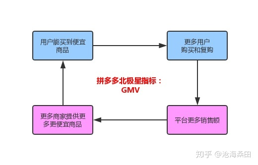

# 如何找到北极星指标？

北极星指标应该是用户价值和公司商业目标的交集，其实也是在构建公司的增长飞轮。

## SMART原则

目标制定最好是能符合SMART原则。

S=Specific、M=Measurable、A=Attainable、R=Relevant、T=Time-bound）
目标是具体的、可衡量的、可实现的、有相关性的、有明确的截止期限。

## 筛选标准
```text
第一，你的产品的核心价值是什么？这个指标可以让你知道你的用户体验到了这种价值吗？
比如说，我现在公司做的是投资App，那么用户的核心价值就是投资，所以这个北极星指标应该和投资有关；

第二， 这个指标能够反映用户的活跃程度吗？
	一般来说，北极星指标都会和用户的活跃度有关。Myspace的“注册用户数” 就没有反应用户的活跃程度；

第三，如果这个指标变好了，是不是能说明你的整个公司是在向好的方向发展？
    比如说，对于Uber来说，如果只是把注册司机数作为北极星指标，显然就忽略了乘客这一方面。
	因此Uber的北极星指标应该能够反映司机和乘客的供需关系和实际成交数，所以“总乘车数”就是更为合适的一个指标。

第四，这个指标是不是很容易被你的整个团队理解和交流呢？
	一般来说，建议选一个绝对数作为北极星指标，而不是比例或百分比。比如说，“总订单数”就比“金额超过100元的订单百分比”好理解

第五，这个指标是一个先导指标 (Leading indicator)，还是一个滞后指标 (Lagging indicator)？
	比如说，SaaS公司喜欢使用收入作为北极星指标，这不是一个坏指标，但是它确是一个滞后指标。
	有的用户很可能已经停止使用几个月了，却还在付月费。在这种情况下，”月活跃用户数“可能是一个更好的先导指标。
第六，
	这个指标是不是一个可操作的指标？(Actionable Metric)
	简单地说，如果对于一个指标，你什么也做不了，那它对你来说相当于不存在。
```

```text
1. 能够反映用户从产品获得核心价值
    对于一个投资应用，其核心价值就是投资，所以这个北极星指标应该和用户进行投资有关。  
    对于电商应用，给用户的核心价值就是能够买到合适的东西，核心是交易，那北极星指标必须和交易相关，  
    比如GMV、销售额等。对于知乎这类问答社区来说，给用户的价值是得到问题的答案，那北极星指标必须与回答问题有关系。
2. 能否为产品达到长期商业目标奠定基础
    公司不仅仅要给用户提供价值，公司本身要能赚钱才能保证持续的为用户提供服务，否则一切都是白谈。
3. 能否反应用户活跃程度
    MySpace以“总注册用户数”作为北极星指标，就是一个累积的静态指标，没有反映出用户当前的活跃程度。
4. 指标变好，能否预示公司在往好的方向发展
    对于Uber来说，如果只是把注册司机数作为北极星指标，显然就忽略了乘客这一方面，  
    仅仅是注册司机变多而乘客数没有跟上，并不一定说明Uber的生意变好了。  
    因此Uber的北极星指标应该能够反映司机和乘客的供需平衡，因此“总乘车数”就是更为合适的一个指标。
5. 是否简单，直观，容易获得，可拆解  
    比如，“总订单数”就比“订单额超过100元的订单比例”容易理解，也更便于各个团队之间协作和交流。
6. 是否是先导指标，而非滞后指标  
    SaaS公司可能会使用月费收入作为北极星指标，这不是一个坏指标，但是它却是一个滞后指标
```

## 案例
```text
AirBnB
	商业模型 = 市场
	核心价值 = 连接想要租房和有房可租的人
	北极星指标 = 预订天数
亚马逊
	商业模型 = 电商
	核心价值 = 便捷的网上购物
	北极星指标 = 销售额
知乎
	商业模型 = 社区
	核心价值 = 知识传播
	北极星指标 = 回答问题数
```

### Facebook & MySpace（聚友网）

MySpace公司运营的主要指标是“注册用户数”，而Facebook在成立的早期就把“月活跃用户数”作为对外汇报和内部运营的主要指标。  

你可能听说过所谓的虚荣指标（Vanity Metric）。  
虽然总注册用户数并不是一个彻头彻尾的虚荣指标，但它却有“虚荣”的成分在。为什么这么说？  

如果MySpace号称自己有100万名注册用户，这里面有多少是5年前注册的？有多少注册之后从来没有二次访问过？  
有多少试用了几次就变成了“僵尸用户”？有多少仍然在使用但是半年才上线一次？  

100万的注册用户可能在给投资人的数据里看起来好看，在员工那里说起来好听，但在公司的内部运营上，  
它也可能让MySpace误判了形势、走偏了方向、抓错了重点，最终在和Facebook的较量中败下阵来。

### 拼多多



## 注意

1. 最后，不要苛求完美，不要试图一步到位。
寻找北极星指标也不是一道只有唯一解的数学题，很多指标之间都有相关性，选哪个并没有本质区别。
    
2. 你的目标是为你的团队找到一个最适合现阶段的聚焦点，让大家在日常工作中能够齐心协力向着一个方向前进。
毕竟，任何方法论都是为了帮助你更好地达成目标。

3. 北极星指标并非绝对唯一，
很多指标都具有相关性，在公司的一定阶段都可以作为北极星指标

4. 北极星指标代表了公司的战略方向，变动周期应该以年为单位，  
但可能随着公司的不同发展阶段而变化  
（探索期：留存率活跃度，成长期：用户增长、总活跃用户数，成熟期：营收利润，付费用户数，衰退期：营收利润，新产品指标

5. 如果发现单一指标不能反映公司的经营情况，可以考虑加入反向指标作为“制衡指标”  
（电商：北极星指标=GMV，反向指标：退货率）
