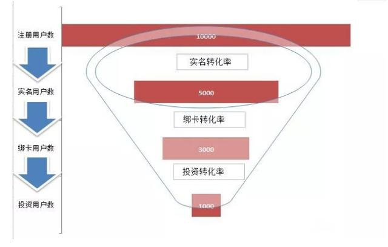

# 用户成长体系

给产品埋下用户成长策略，建立用户成长通道。

## 新手引导
新用户对平台有一个认知的过程，让用户快速的了解我们是谁，提供什么样的产品和服务？有什么样的保障？

## 新手特权
我在负责百度糯米的运营的时候，我们分析过一组数字。  
我们分析发现每天移动端活跃的DAU里面有几十万是非当日下载，但从未下单的用户。  

这个数据说明了什么问题？说明的就是用户对你比较感兴趣，但是缺乏下单的动力，而且这个用户的量级还不是一个小数目。  
那就迫切需要做好APP首页的新手引导和新手特权，刺激用户完成首次下单的动作。  
因此，我去推动上线了新手专区，在APP首页强化。上线之后新客量和新客转化率大幅度提升。

## 建立高效率的用户链接通道 - 触达

互联网是眼球经济，每个用户在手机上的总时间是有限的，能分配到每个APP上的时间就更是少之又少，  
我们要想提升用户在访问APP期间的交易转化，就需要想办法提升跟用户接触的种渠道和方式，  
尽可能增加用户访问APP的机会，将用户从离线状态拉回到在线状态。  

只有在线的次数越多时间越长才越有可能往交易方向转化。

## 设计用户成长激励机制

用户的成长分两种：一种是推，一种是拉。
拉是通过核心供给驱动用户自然成长，这属于最优质的那部分用户；
另外大多数的用户需要靠运营手段和激励机制推动往前走。

比如用户注册完成赠送什么东西，首次投资赠送什么东西，复投再赠送什么东西。  
通过这些手段扩大每个阶段的用户群，然后再从这些用户群体中筛选真正优质的用户。

## 建立核心数据指标，建立漏斗转化模型，挖掘有效渠道，高效支撑用户增长

在产品早期一定要找到一条健康的用户增长通道，打通产品转化率的各个环节，  
建立起数据驱动运营和支撑产品迭代的运营模型。  
为规模推广之前做好充分的准备。

在业务早期不一定要非常多的数据指标，只需要关注最终的目标数据即可。

互联网业务是一个非常长的漏斗，但我们早期业务做数据分析的时候尽量简化这个漏斗，  
看核心问题出在什么地方，然后再就单个指标去做深入分析。

## 建立驱动用户增长机制
打造优质供给。  
所有的互联网产品都是围绕供需展开，只是供给的形式有所区别，电商是实物商品、O2O是服务、金融是优质资产、社区是优质的内容。  

用户增长首先还是要围绕用户的核心需求去展开，不断打磨核心供给能力，  
围绕用户的核心需求之外的需求做延伸，增加用户的使用频度和使用粘性。

## 探索运营模式
是用户运营为主，还是内容运营为主、线下会议营销为主？

## 产品功能逐渐叠加、运营不断打磨，新的功能带动用户持续增长
运营跟着产品走。  
产品不断推出新的功能，运营就需要快速跟进给新产品导入用户，加强用户对于新产品的认知，  
提升新产品的转化率，并且找出用户在产品使用过程中遇到的问题，反向推动产品做改进。  

运营在初期就深度介入到产品里面去，持续运营和迭代。  
运营需要打磨出一条从产品发布，导入用户，收集问题反馈，查看数据，分析转化率、留存等数据，提出产品迭代需求，产品迭代完整的闭环。
