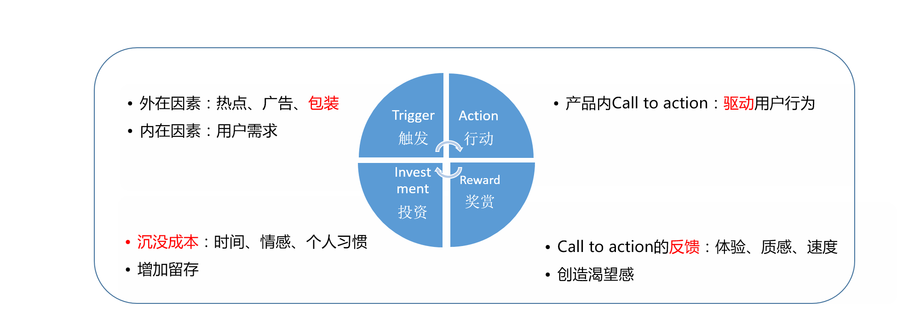

# 用户激活

用户激活是指引导用户体验到产品的核心价值，比让其产生继续使用产品的动力。

* 理解误区
```text
1. 激活意味着用户触达
2. 激活意味着注册成功
```

## 如何衡量？

不同企业对“激活”的定义不同，一般将 ***新用户完成核心功能的初步体验*** 称为“激活”。
比如：电商产品用户的一次购物，互联网金融产品用户完成绑定一张银行卡。

## 如何搭建激活分析框架?

### 找到： Aha时刻

* 案例
```text
Slack 团队内部发送2000条信息。
Dropbox 一台设备上安装一个Dropbox，里面有一个文件。
LinkedIn 用户一周内建立4个联系人。
Zynga 用户注册后第二天返回。
Facebook 用户7天内加了10个好友。
```

### [设计： Hook模型 -《上瘾》 ](HookModel.md)



### 衡量：激活指标

设计并实施新的激活方式后，就要对激活指标进行持续监测，已评估效果。

常见衡量指标有：
激活率、激活漏斗转化率、激活用户的留存情况。

### 激活率

指用户在一定时间内完成激活行为的用户数占激活触达总人数的比例。
三个要素：
```text
“完成激活行为”
    可以是 Aha时刻，也可以根据产品的形态，指定其他行为。

“完成激活行为的时间长短”
    它与产品形态有关，不同产品会选择不同的激活时间，如选择首日、次日和首周的激活率。

“激活触达”
    就是Hook模型中触发用户的内外部手段。
```

* 激活率如何计算？
```text
如：电商平台，激活用户定义为注册两天内产生订单的用户，那么激活公式就是：
激活率 = 注册2天内产生订单的用户（完成激活行为的人数） / 2天内总的注册人数
```

### 激活漏斗转化率

指追踪用户从注册到激活的全过程中，用户完成的每一个步骤占上一个步骤的比例。

通过计算每一步的转化率，就能发现造成流失的环节，然后优化该环节。
解决这个问题需要进一步模拟用户行为，研究该环节用户的心理、产品体验、文案、交互设计，以及引导激励等，然后通过AB实验不断优化提升。

### 激活用户的留存情况

在检测激活指标的同时，也要监测各项关键行为对北极星指标的影响。

```text
如：北极星指标是活跃用户数，经过分析发现购买过商户的用户活跃度最高，那么现阶段激活指标就是，让用户完成第一次购买。
但在后来的产品迭代中，发现充值称为会员的用户活跃度远高于购买过的用户，因此基于北极星指标，应该调整用户激活指标，引导跟多的用户成为会员。
```

### 迭代：优化薄弱环节

指标监测无法定位到具体的薄弱环节，此时可以通过构建激活行为漏斗来实现。

```text
如 以拉新为例，漏斗第一步是用户下载产品，第二步打开产品，第三步完成注册，第四部完成我们定义的激活行为。
通过激活漏斗，我们会对薄弱环节有直观的感受，根据分析结果提出相应的假设，通过不断迭代来建立最优的激活机制。
```

## 如何提升激活？

### 增强动力

指通过一些列的运营手段（比如限时免费、红包福利等），激发用户使用产品的动力，从而提升激活率。

```text
如：
视频App在投放广告的时候可以提示“下载App，即可免费使用一个月会员。”
电商App“新人专享红包”。
```

### 减少障碍

即减少不必要的环节，没多一个环节都可能给用户增加障碍。

```text
如：启动App可以先体验在注册，而不是相反，应该一切从简，删除多余的步骤和内容。
```

### 增加引导

指用户接触产品后，产品可以引导用户到最关键的操作上来。

```text
如 微信读书会先赠送用户10-20天的免费时候时长，随后再赠送免费读书馆和免费听书馆的书籍。
再次再向用户展示本周飙升榜中的热门书籍，不断的引导用户来阅读书籍。
```

### 个性化定制

指产品可以给用户提供个性化定制的体验/服务。

```text
如 针对不同投放渠道进来的用户，启动页面显示不一样的内容。
如 用户在启动App后有个性化选择的页面，用户自己来选择感兴趣的内容/产品，之后可以根据用户选择来推送。
```