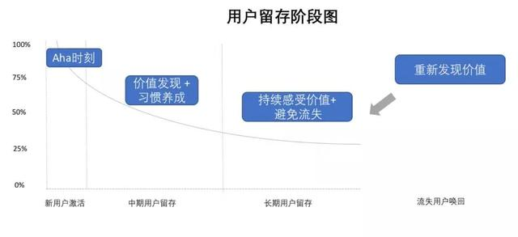

# 用户留存

在互联网行业里，通常会通过拉新把客户引过来，但是经过一段时间可能就会有一部分客户逐渐流失了。
那些留下来的人或者是经常回访我们公司网站 / App 的人就称为留存。

留存几乎是整个商业模式的验证和产品质量的验证。

花钱可以买来新用户，但是买不到留存。
也没有一个商业模式，让你一直给用户钱，让他持续使用你的产品。所以留存特别重要，留存很大程度上是产品决定的。

很多产品设计的非常好，确实解决了用户的痛点，它的留存就比较好。
但是增长团队也是可以做很多事情，改善用户的留存的。

* 留存的重要性

```text
它是商业模式的终极检验，也是需要全公司上上下下做的事情。
它听起来没有拉新这么性感，但它是增长最关键的一部分。
```

## 留存的三个周期

```text
振荡期
选择期
平稳期
```

## 留存的四个不同阶段


```text
1. AHA时刻、新用户的激活是留存的第一步
2. 有一个价值发现和习惯养成的过程，他们首先确保用户达到了AHA时刻，第一次完成了某个关键行为。
3. 长期来看，你需要持续给用户提供价值，避免他们流失掉。
4. 最终如果有用户流失掉了，你希望把他们唤回。
```

## 留存分析

留存分析是一种用来分析用户参与情况/活跃程度的分析模型，考察进行初始行为的用户中，有多少人会进行后续行为。
留存分析是用来衡量产品对用户价值高低的重要方法。保证产品活跃用户正向增长，最终完成持续地变现。

一般从用户群组和产品功能两个角度来进行分析。

* 分析用户对不同产品功能的使用粘性与活跃度

一般我们不仅需要关注整个网站 / App 的留存，还需要关注核心行为的留存率，比如重复购买的情况。
对产品进行迭代时，我们还可以使用产品功能留存观测这个功能的留存率整体有没有提高。

### 留存曲线
```text
1. 找到关键行为，它和AHA时刻比较一致。
    因为每一个产品都有一个关键的用户行为，这是非常有价值的用户行为。

2. 到关键行为之后，去发现用户的天然使用周期。
    比如，今年一月份，有多少用户完成了关键行为
    比如，这个产品的留存率是不是在稳固提升。
```

## 提高留存

***尽快触达Aha时刻*** 
通常情况下，用户在早期流失现象非常严重。产品需要让用户快速容易的体验到产品的价值。
一旦用户发现产品对自己的价值，继续使用和探索产品新功能的概率就会增大很多。

### 提升用户留存工具

```text
新用户体验和引导
邮件
通知/推送
促销
忠诚客户计划
客服
产品改进
新产品
```

## 增长案例

```text
Facebook通过优化产品适应非洲网络环境，初期非洲网络速度很慢，用户留存度很低
Twitter向新注册用户推荐关注用户。
```