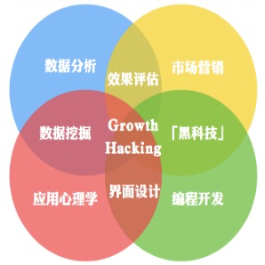

# 什么是用户增长？

互联网的世界里一切都是为了增长，灵光一现的创新可能会让一个产品成功，但绝不可能长久
简单来说，用户增长的根本目的是为了提升产品在一段时间内的有效用户数，进而提升当下和未来的GMV和利润，实现商业成功。



* 乔布斯

“Growth is connecting more people to the existing value of a product。”
```text
产品的 existing value
	必须要有一个核心的产品价值能够传递给我们的用户

connecting
	把更多的用户和我们既有的产品的价值相连接，这才是真正的 Growth。
```

要使用户能够形成自然增长的势能最后指数级增长，都是依托产品的核心价值。
同时除了让用户了解到产品价值，还需要通过一些传播的方法，让更多的用户能够了解。

* 增长是一门科学

以用户导向扩展至MVP，AB测试和留存分析，乘胜追击，用户体验地图，注重用户思维，讲究敏捷开发，快速迭代。
数据的价值，用户的反馈，也提到了一个新的高度。

* 背景

市场已经由原来的卖方市场，彻底过渡到现在的买方市场，市场运营理念也从“ 以产品为中心”变成“以用户为中心”。
用户运营思维也由过去的从“吸引认知——引起兴趣——产生渴望-试用评估—购买”的漏斗思维，转化为倒三角的增长思维。

* 趋势

用最小成本购买优质用户
留存一定要做高
同时通过一定的用户运营实现活跃用户的价值输出，即超级用户思维

* ***阶段***
```text
问题与方案匹配
	针对需求提出解决方案
产品与市场匹配
	最小化验证市场反馈
渠道与市场匹配
	完成产品的冷启动，有限的预算有效率投放在质量高的渠道，拓展用户规模
企业与市场匹配
	提升用户忠诚度，深挖用户价值
```
